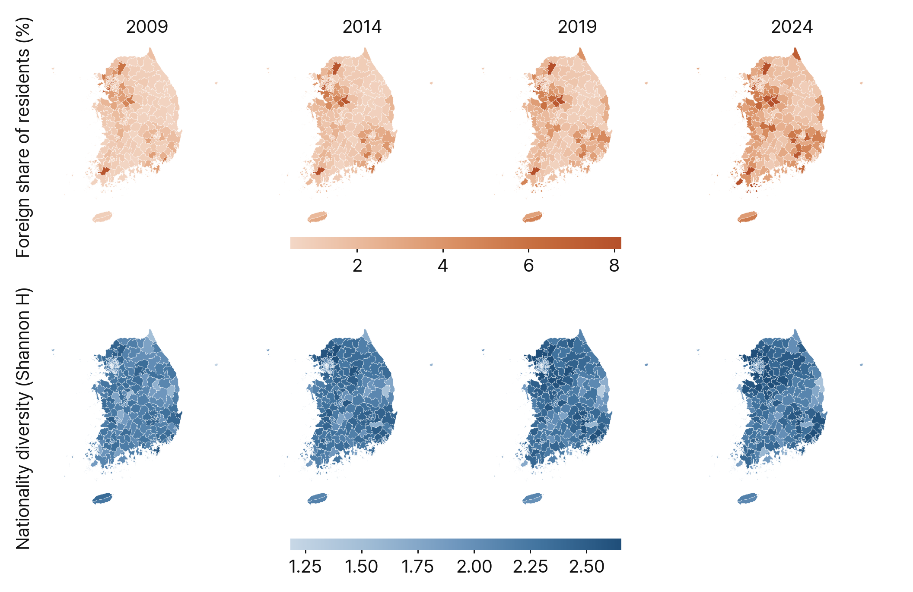
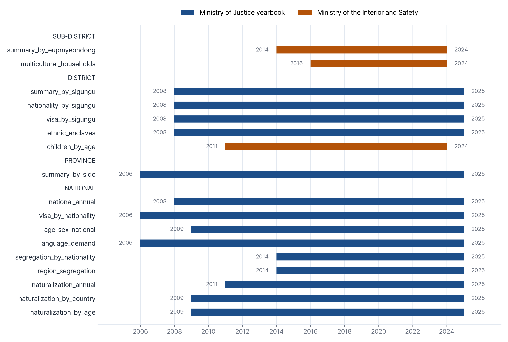
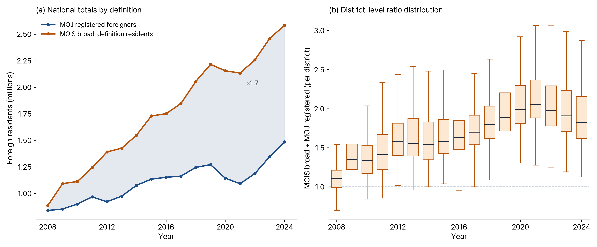
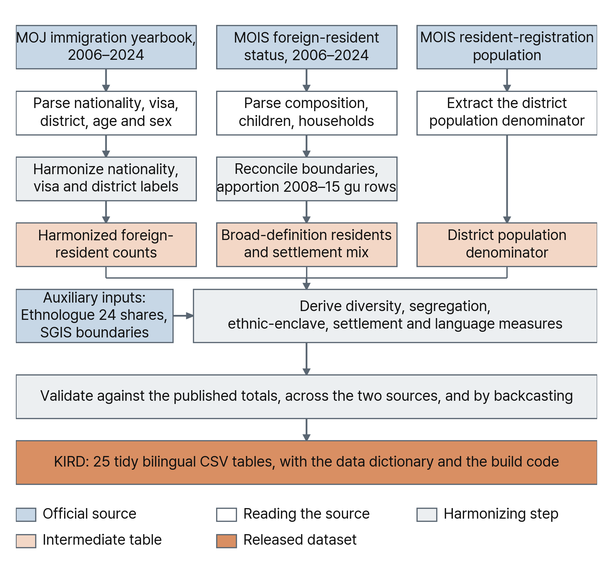

# KIRD: Korea Immigration and Residential Diversity

[](https://doi.org/10.3886/E249944V1)
[](https://doi.org/10.3886/E249944V1)
[](LICENSE)
[](https://www.python.org/downloads/)

KIRD is a harmonized panel of foreign residents in South Korea, built from the annual
statistical yearbooks of two ministries and released as 27 tidy tables. It reports how many
foreign residents lived in each district each year, which nationalities they held, which visas
they were on, and a set of derived measures: the foreign share of the population, nationality
diversity, residential segregation against Korean nationals, ethnic-enclave districts, and the
number of speakers of each language implied by the nationality composition. Every table carries
English labels beside the Korean ones.

Each yearbook is published as a separate workbook whose layout, nationality names, visa codes and
district names change from edition to edition, so the same district in 2009 and 2019 joins on
nothing. This repository holds the code that makes them join. It reconciles the naming across
editions, carries the administrative boundary changes in section 6, and computes every derived
measure on one basis for all years. The data is deposited on openICPSR.



## 1. Deposit

The tables are on openICPSR at [doi.org/10.3886/E249944V1](https://doi.org/10.3886/E249944V1),
as CSV and as labeled Stata `.dta`, with `data_dictionary.csv` and a README that documents every
column in English and Korean. This repository holds the code and the documentation; neither the
released tables nor the raw ministry workbooks are in it, so start from the deposit.

## 2. Released tables

Four summary tables give one row per place per year; the province and district tables carry the
derived indices beside the counts, and the sub-district table carries the MOIS counts alone. The other twenty-three hold the breakdowns those summaries aggregate; from v1.2.0 the nationality
and visa breakdowns exist at all three levels (district, province, national), and `language_demand`
carries a `sido` scope, so no level has to be reconstructed from another.

| File | One row is | Years | Rows |
|---|---|---|---|
| `national_annual.csv` | a year | 2008-2024 | 17 |
| `summary_by_sido.csv` | a province and a year | 2006-2024 | 317 |
| `summary_by_sigungu.csv` | a district and a year | 2008-2024 | 4,240 |
| `summary_by_eupmyeondong.csv` | a sub-district and a year | 2014-2024 | 39,017 |
| `nationality_by_sigungu.csv` | a district, nationality and year | 2008-2024 | 173,723 |
| `nationality_by_sido.csv` | a province, nationality and year | 2008-2024 | 24,885 |
| `nationality_national.csv` | a population, nationality and year | 2006-2024 | 7,236 |
| `visa_by_sigungu.csv` | a district, visa status and year | 2008-2024 | 75,989 |
| `visa_by_sido.csv` | a province, visa status and year | 2008-2024 | 7,083 |
| `visa_national.csv` | a population, visa status and year | 2006-2024 | 1,240 |
| `visa_by_nationality.csv` | a population, nationality, visa and year | 2006-2024 | 236,379 |
| `age_sex_national.csv` | a nationality, age band, sex and year | 2009-2024 | 100,828 |
| `language_demand.csv` | a language, scope, place and year | 2006-2024 | 208,849 |
| `ethnic_enclaves.csv` | an enclave district, nationality and year | 2008-2024 | 739 |
| `segregation_by_nationality.csv` | a nationality and year | 2014-2024 | 1,062 |
| `region_segregation.csv` | a continent of origin and year | 2014-2024 | 118 |
| `naturalization_annual.csv` | a year and processing route | 2011-2024 | 140 |
| `naturalization_by_country.csv` | a year, former nationality and route | 2009-2024 | 14,641 |
| `naturalization_by_age.csv` | a year, age band and route | 2009-2024 | 1,532 |
| `children_by_age.csv` | a district, single year of age and year | 2011-2024 | 63,347 |
| `multicultural_households.csv` | a sub-district, household category and year | 2016-2024 | 299,791 |

Districts are the units the Ministry of Justice publishes, roughly 250 per year, including the
general districts of large cities such as 안산시 단원구. Sub-district files use that year's
administrative boundaries and carry the official code as a language-neutral join key.



## 3. MOJ and MOIS counts

The two ministries count different people, and both counts are in the data under separate column
names. Reporting one number without saying which is meant is the most common way to misuse this
dataset.

**MOJ registered foreigners** (`registered_foreigners`) are foreign nationals on a residence permit
longer than 90 days. Naturalized citizens are not in it, because they are no longer foreign
nationals, and neither are the Korean-born children of foreign residents. It is the count that
supports the nationality, visa and diversity measures, since the yearbook publishes it by
nationality and by visa.

**MOIS broad-definition foreign residents** (`broad_total`) add the two groups MOJ leaves out:
`naturalized` residents and `children` of foreign residents, on top of `non_naturalized`. It is
published down to sub-district level and carries the multicultural-household detail, but it is not
broken out by nationality.

The two are not interchangeable and their sum counts the same people twice. Nationally
`broad_total` ran 1.05 times `registered_foreigners` in 2008 and 1.74 times in 2024. The gap widens
as naturalizations and Korean-born children accumulate, so the choice of definition moves the trend as well as the level.



## 4. Derived measures

Every index is computed from the columns released beside it, so any of them can be recomputed and
checked.

`foreign_share_pct` is `registered_foreigners / resident_pop * 100`, where `resident_pop` is the
MOIS resident-registration population of Korean nationals. The same denominator is used everywhere,
so the share reproduces exactly from the two released columns.

`shannon_H` is the Shannon entropy of the nationality composition within the foreign population,
and `shannon_H_inclusive` treats Korean nationals as one further group, which is the ethnic
diversity of the district as a whole. `HHI` is the Herfindahl-Hirschman index of the same
composition and `evenness` is Pielou's, `shannon_H / ln(index_base_k)`. `continent_H` groups
nationalities into world regions.

All diversity indices are computed on a uniform basis of the year's top 19 nationalities plus one
residual bin, so the series stay comparable across the 2014 coverage break; `index_base_k` is the
size of that basis (named `n_nationalities` through v1.1.0), and `n_nationalities_observed` is the
count of nationalities the source actually lists for the unit (capped at 19 through 2013). From
v1.2.0 every breakdown also exists at all three levels: `nationality_by_sigungu` /
`nationality_by_sido` / `nationality_national`, `visa_by_sigungu` / `visa_by_sido` /
`visa_national`, and the `scope` column of `language_demand`; `region_segregation`'s key column is
named `continent`.

`dissimilarity_D` in the segregation files is the index of dissimilarity of one nationality against
Korean nationals across districts, `0.5 * sum |x_i/X - k_i/K|`, with `isolation` the exposure measure
(`segregation_by_nationality` adds `interaction_korean`, exposure to Korean residents). `theil_segregation_H` in `national_annual.csv` is
the multigroup entropy index over Korean nationals plus each nationality. `morans_I_share` is
Moran's I of the district foreign share on queen contiguity, the spatial clustering dimension.

An **ethnic enclave** is a district where one nationality has a location quotient of at least 2 and
makes up at least 30 per cent of that district's foreign population, with an absolute floor of 200
people. The location quotient alone would flag a nationally rare nationality on a small local
cluster, and the share alone would flag a district with few foreign residents of any kind.

`language_demand` converts the nationality composition into implied speakers using mother-tongue
shares from the [Ethnologue 24 Global Dataset](https://www.ethnologue.com/), so one nationality
contributes fractionally to several languages. Korean is excluded, which is why the national total
is well below the foreign population: nationalities whose first language is Korean, such as ethnic
Koreans from China, contribute no demand. District rows carry the top 20 languages. The national
scope is computed from the published national staying-foreigners composition, the province and
district scopes from the registered district-assigned tables, so the scopes are not nested sums.

Diversity indices are computed on the top 19 nationalities plus a residual for every year. The
yearbooks publish only the top 19 at district level before 2014 and the full detail afterwards, and
an index that used all available nationalities would jump at 2014 for a reason that is not a change
in the population.

## 5. Pipeline

`code/run_pipeline.py` is the complete step list in dependency order: ten numbered steps in three
phases, `kird.py`, the one module they all import, and the unnumbered checkers and helpers the
tables below describe.

| Phase | Steps | What it does |
|---|---|---|
| 1 | `01_parse_yearbooks` `02_language_reference` `03_extend_panel` `04_reconcile_districts` `05_mois_layer` | reads the raw ministry workbooks and writes the harmonized panel |
| 2 | `06_build_summaries` `07_build_naturalization` `08_export_dataset` `09_finish_release` `make_coverage_figure` `sync_repo_figures` | turns the panel into the released tables (`09` must print `AUDIT CLEAN`) and rebuilds the repository figures |
| 3 | `10_stage_deposit` | stages the openICPSR deposit (wide summaries, `.dta` pairs, its own gate) |



```
pip install -r code/requirements.txt
KIRD_ROOT=/path/to/KIRD python code/run_pipeline.py
```

```
python code/run_pipeline.py --phase 2                      # release tables only
python code/run_pipeline.py --from 08_export_dataset.py    # resume at a step
```

`code/kird.py` resolves every path from the project root, so the scripts run from any location and
`KIRD_ROOT` points them at another checkout. Python 3.10 or newer. Every step is described in
[`code/README.md`](code/README.md).

**The raw ministry workbooks are not in this repository**, so a bare checkout documents the build
rather than reproducing it: run it as-is and phase 1 stops at the first missing workbook, phase 2 at
the first missing intermediate. That is the expected result, not a broken checkout. To rebuild from
scratch, download the yearbooks from the agencies in section 8 into `01_raw_data/` under the layout
that `code/README.md` describes, then run the whole pipeline (phase 2 alone cannot run without the
phase 1 output). `code/migrate_v1_2_0_nationality_columns.py` is a one-time v1.1.0 -> v1.2.0 repair
kept for provenance; a fresh build does not need it.

## 6. Administrative boundary changes

Districts merge, split and get renamed, and each yearbook uses the names of its own year. Every case
below is reconciled to one label so a district's series is continuous. The published counts are
never altered; only the label a row carries.

- **인천 남구 → 미추홀구**, renamed 2018. Every year is filed under 미추홀구.
- **경상북도 군위군 → 대구광역시 군위군**, transferred to Daegu 2023. Every year is filed under Daegu.
- **부천시 원미구 / 소사구 / 오정구**, general districts abolished 2016 and re-created 2024. All years
  are one 부천시, because the district level exists for only part of the series.
- **경상남도 마산시, 진해시 → 창원시**, merged July 2010. 2008 and 2009 keep their own city rows,
  since the post-merger district rows do not exist yet; 진해시 is carried onto 창원시 진해구.
- **세종특별자치시**, created July 2012. The district panel carries 세종시 as one continuous unit
  from 2008; there is no separate 연기군 row. At province level Sejong is counted inside 충청남도
  until 2011, following the source.
- **충청북도 청원군 → 청주시 청원구**, absorbed by Cheongju 2014. Values before 2014 are carried onto
  청주시 청원구.
- **경기도 여주군 → 여주시** (promoted 2013) and **충청남도 당진군 → 당진시** (promoted 2012), county
  to city promotions with no boundary change.
- **강원도 → 강원특별자치도** (2023) and **전라북도 → 전북특별자치도** (2024), province renames with no
  boundary change. One label each.

Four kinds of row are dropped, because keeping them would double count: a city total that repeats
the general districts listed below it (수원시, 창원시), the 화성시동부출장소 sub-office whose
population is also in its parent city, a 포천군 row that appears in the 2009 sheet six years after
the county became a city, and a Sejong row whose district cell holds a literal 0.

## 7. Caveats

District-level nationality detail begins in 2008 and district-level indices in 2009.

A district-level sum is slightly below the published national total, by about 0.2 per cent, because
the yearbook's district table does not place every registered foreigner in a district.
`national_annual.foreign_total` is documented as the district sum, so the two agree within the data
even though the national total in the yearbook is marginally higher.

The province tables carry the yearbook's own province rows, so they differ from a sum of the
districts by a few thousand people a year. Both figures are the publisher's.

Districts in a boundary-change year sometimes have no population denominator, because the Ministry
of Justice and the Ministry of the Interior adopted the change in different years. Those rows carry
a null denominator.

The panel ends in 2024, the last year both ministries have published. The 2025 Ministry of Justice
yearbook is out; the matching MOIS foreign-resident statistics are not, so a 2025 row would carry
MOJ counts against empty broad-definition columns.

The naturalization panels are assembled from every yearbook edition, since each one publishes only
its own year at country and age level. They reconcile to the separately published annual totals
within five
cases a year in most years. Joining the tables on space-normalized type labels, seven
year-type cells exceed that: 2017 국적선택 -10 and 국적판정 -7, 2018 국적상실 -8,
2019 국적상실 +7 and 국적취득(재취득) +18, 2024 국적취득(인지) +8 and 국적취득(재취득) +16.
The 2017 edition's own country rows also exceed its printed continent subtotals by 1,357. The figures are published as issued.

## 8. Sources

- Ministry of Justice, [Korea Immigration Service Statistical Yearbook](https://www.immigration.go.kr/immigration/1570/subview.do)
  (출입국·외국인정책 통계연보), 2006-2024
- Ministry of the Interior and Safety, [Local Government Foreign Resident Status](https://www.mois.go.kr/frt/bbs/type001/commonSelectBoardArticle.do?bbsId=BBSMSTR_000000000014&nttId=121226)
  (지방자치단체 외국인주민 현황), 2006-2024, posted edition by edition on the ministry's approved-statistics board
- Ministry of the Interior and Safety, [Resident Registration Population](https://jumin.mois.go.kr/)
  (주민등록 인구통계), the denominator
- Statistics Korea, [SGIS](https://sgis.kostat.go.kr/view/index) administrative boundaries, via the
  [vuski/admdongkor](https://github.com/vuski/admdongkor) yearly snapshots
- SIL Global, [Ethnologue 24 Global Dataset](https://www.ethnologue.com/), first-language shares by
  country, for `language_demand`

## 9. Dashboard

The dashboard at [immigrantsinkorea.today](https://immigrantsinkorea.today) is built from these
tables and shows the same series by year, district and nationality.

## 10. Citation

Yoo, N. (2026). *Spatiotemporal administrative dataset of nationality, residential diversity, and
language demand among immigrants in South Korea, 2006-2024* [Data set]. Ann Arbor, MI: openICPSR.
https://doi.org/10.3886/E249944V1

[CITATION.cff](CITATION.cff) holds the machine-readable record. The version belongs in the citation:
the year coverage and several derived columns differ between versions.

## 11. Licence

CC BY 4.0, see [LICENSE](LICENSE). The underlying statistics are public Korean government data.
Attribution should name Nari Yoo, University of Michigan School of Social Work, and the openICPSR
record.

## Contact

Nari Yoo, University of Michigan School of Social Work, nariyoo@umich.edu
